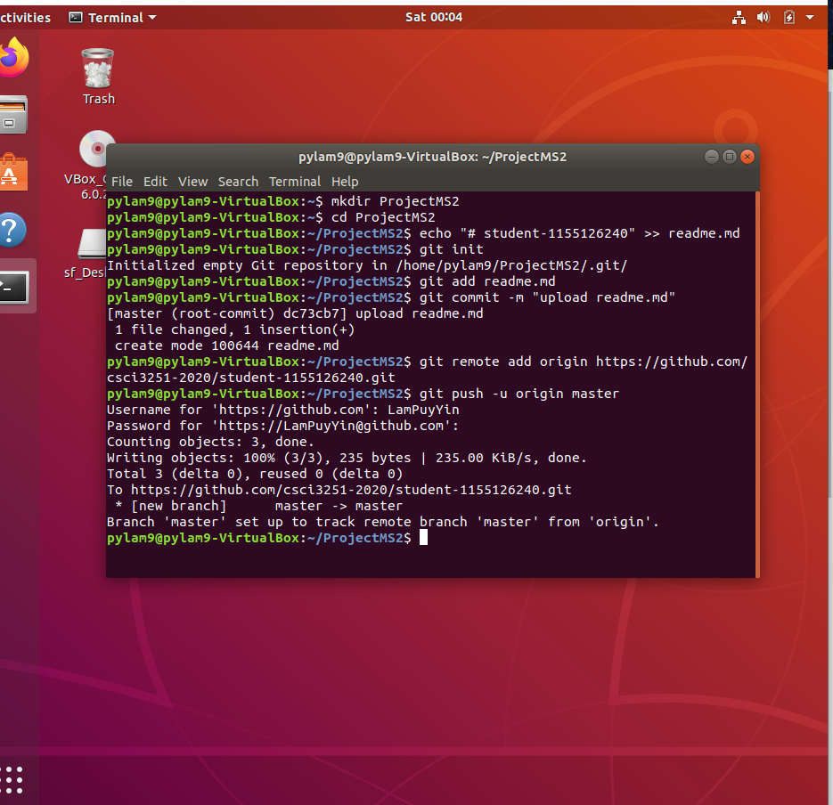

# This is a header :)

## Introduction...

Hey guys~ Name's Adrian Lam, a year 2 CSE student in CUHK...
~~And a Github newbie~~

## Currently learning these programming languages!

* C and C++
* Java
* Python (Only a bit tho...)

## What I usually do in free time, you ask?

- [x] ~~Sleep (duh)~~
- [x] do drawings!
- [x] code program!
- [x] listen to music!

## Well that's all! 
### Huh, so what now?

Let just take a good look at this __table__ then...

A | Smol | Table!
--- | --- | ---
*Am* | __I__ | **too**
bored | or | something...

## Oh right, I almost forgot the screenshot :P

